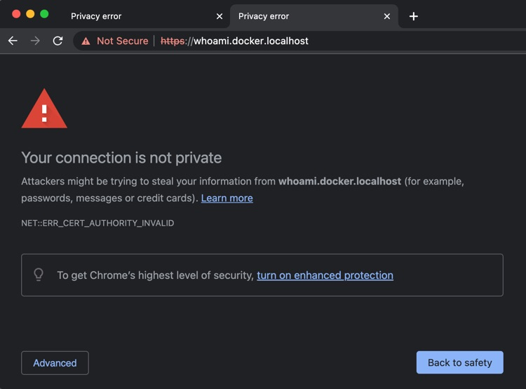

# traefik-docker-tls

How to use [Docker][docker] and [Traefik][traefik] to run a local development environment under TLS (aka: https on localhost)

You are about to learn:

- How to generate a TLS certificate for your development environment
- How to setup Traefik for running _HTTP(S)_ services

Before you move on, make sure you take a good read at the introductory tutorials:

- [How to run a _Create React App_ development environment using Docker, Docker-Compose, and Traefik][tutorial1]
- [How to use Traefik to drive traffic to independent docker-compose projects][tutorial2]

## Table of Contents

## Setup Your Certificates

A precondition to run this tutorial is to setup your development machine as a _Certificate Authorithy_ that your browser can trust. 

> You need this step to avoid running into weird privacy warnings from your browser:



### Setup Your Machine

[Mkcert][mkcert] worked very well during my research.

😎 Mac users: just run `make install` 😎  
🚧 Windows & Linux users: read the [full documentation](https://github.com/FiloSottile/mkcert#installation)

### Generate Custom Certificates

A certificate should contain the full list of domains that you intend to use in your local setup.

The following command generates a certificate with the local domains that we are going to use in this tutorial. You should carefully adjust it to your needs when running TLS in your projects.

```bash
mkcert -cert-file certs/local-cert.pem -key-file certs/local-key.pem "*.docker.localhost"
```

> 😬🧐😫😒  
> I tried right away to run the setup with `*.localhost` but Chrome does not trust this kind of certificate.
>
> **It only accepts 3rd level wlidcards.**

## v1 - With Config Files

Moving my first steps into local TSL, I resolved to my best friend Google and found out this setup:

https://github.com/Heziode/traefik-v2-https-ssl-localhost

You can run it as:

```bash
cd v1
docker-compose up
```

There is not much to say, it works well enough.

In my version, I believe I've simplified things a bit:

- just map the config folder instead of single files
- enable TSL by default on every route
- removed external network (although it could come in handy)

## v2 - With Labels

Althoug V1 works, I'm not a big fan of multiple configuration files. I like to keep stuff as simple as they can possibly be.

Traefik offers the amazing feature of providing configuration via [_Docker Labels_](https://docs.docker.com/config/labels-custom-metadata/) and the [`command`](https://docs.docker.com/compose/compose-file/compose-file-v3/#command) field, which I use in my projects to centralize its configuration withing the `docker-compose.yml`.

I googled this out a lot, and managed to run a fully working TLS setup that generates self-signed certificates, all by using commands and labels in [`docker-compose.yml`](./v2/docker-compose.yml):

```bash
cd v2
docker-compose up
```

Unfortunately, this way of running TLS generates [privacy errors](./images/privacy-warning.jpg) as the browser does not trust the certificate.

> I google id all around but I found no way to provide the real certificates using labels 😫.

Here some resources I used:

- [Traefik labels reference](https://doc.traefik.io/traefik/reference/dynamic-configuration/docker/)
- [Traefik dynamic configuration reference](https://doc.traefik.io/traefik/reference/dynamic-configuration/file/)
- [Traefik TLS Docs](https://doc.traefik.io/traefik/https/tls/)
- [A guy asking the same thing on Github](https://github.com/traefik/traefik/issues/990)

In the end, I gave up and built a [minimal dynamic config file](./v2/traefik-config.yml) that only provides the TLS certificates:

```bash
cd v2
docker-compose -f docker-compose-with-config.yml up
```

> I don't think this hybrid configuration is a good idea.

## v3 - With Custom Image

In the pursue of minimizing, or at least, centralizing the configuration that we need to run a local environment, I came up with the idea of packing everything within a custom Docker image.

I found [this page on Stackoverflow](https://stackoverflow.com/a/59245613/1308023) that gave inspiration how to pack the Traefik's config files inside the [`Dockerfile`](./v3/Dockerfile) that I use to spin up the instance.

Although ths syntax is a bit cumbersome with all the explicit returns of line `\n\`, I still like this approach, for I will possibly never have to chage this setup.

If I want to run my containers on different domains, say `foo.bar.localhost`, I'd only have to generate a new certificate that contains also `*.bar.localhost`:

```bash
mkcert -cert-file certs/local-cert.pem -key-file certs/local-key.pem "*.docker.localhost" "*.bar.localhost"
```

A possibile improvement over this implementation would be to actually inline the whole `Dockerfile` within the `docker-compose.yml`. I found [an open proposal](https://github.com/compose-spec/compose-spec/issues/216) for doing exactly that, but it is not possible just yet.

## v4 - With Docker Image

The final step was for me to simply push my custom image to Docker Hub:

```yml
version: '3'
services:
  proxy:
    image: marcopeg/traefik-local-tls
    ports:
      - 80:80
      - 443:443
    volumes:
      - /var/run/docker.sock:/var/run/docker.sock:ro
      - ../certs:/etc/certs:ro

  whoami:
    image: containous/whoami
    labels:
      - "traefik.enable=true"
      - "traefik.http.routers.whoami.rule=Host(`whoami.docker.localhost`)"
```

You can run this as:

```bash
cd v4
docker-compose up
```

[tutorial1]: https://github.com/marcopeg/cra-docker-traefik#readme
[tutorial2]: https://github.com/marcopeg/traefik-docker-multi-project#readme
[traefik]: https://traefik.io/
[dc]: https://docs.docker.com/compose/
[docker]: https://www.docker.com/get-started/
[nginx]: https://www.nginx.com/
[make]: https://www.gnu.org/software/make/
[mkcert]: https://github.com/FiloSottile/mkcert